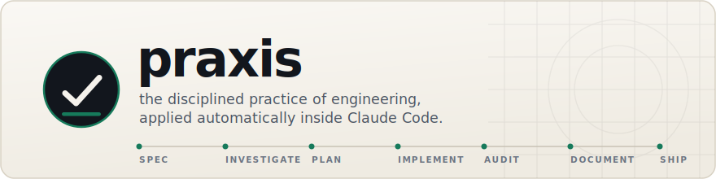
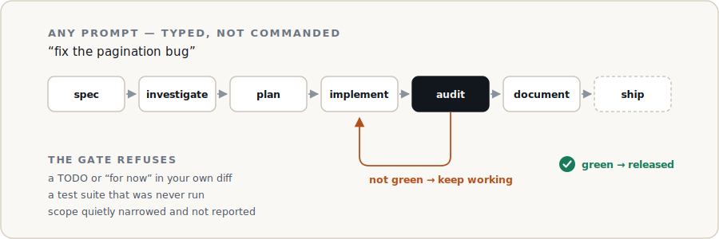
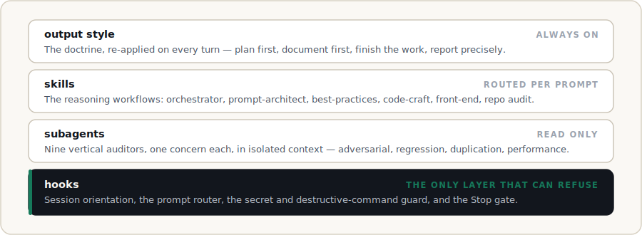

<p align="center">
  
</p>

<p align="center">
  <a href="https://github.com/Ohswedd/praxis/actions/workflows/release.yml"></a>
  <a href="https://github.com/Ohswedd/praxis/releases/latest"></a>
  
  
  <a href="LICENSE">
  </a>
</p>

Claude Code will happily tell you a change is done. Praxis is the part that
disagrees. It turns the review you would otherwise retype into every prompt —
*read the docs first, reuse what exists, try to break it, check what it broke,
finish it* — into behaviour that lives in the session lifecycle, and it holds a
turn open until the work actually holds up.

*Praxis* is theory enacted: the point at which principles stop being advice and
become what you do.

**Contents** ·
[Install](#install) · [How it works](#how-it-works) · [What you get](#what-you-get) ·
[Commands](#commands) · [Configuration](#configuration) · [Safety](#safety) ·
[Docs](#documentation)

## Install

```
/plugin marketplace add Ohswedd/praxis
/plugin install praxis@ohswedd-praxis
/praxis:bootstrap
```

Then describe what you want — *"fix the pagination bug"*, *"integrate Stripe"* —
and pick your effort (`/effort high`, or `ultracode`). There is no command to
remember: the `praxis-quality` output style enables itself with the plugin, and a
prompt router engages the right skills from how you phrased the request.

Requires **Claude Code** (v2.1.139+ recommended) and **Python 3.8+** on `PATH`.
Hooks are standard-library only — no pip installs, no third-party supply chain.
macOS and Linux work out of the box; on Windows, ensure `python3` resolves.

> **Installed before v1.5.1?** The marketplace was renamed `praxis` →
> `ohswedd-praxis`, because an unrelated project publishes one under the old name
> and Claude Code keeps only one marketplace per name. Run
> `/plugin marketplace remove praxis`, then the commands above. The plugin and
> every `/praxis:*` command are unchanged.

## How it works

You state the idea. Praxis sizes the request, runs the pipeline, and refuses to
call it finished until the audit is green.

<p align="center">
  
</p>

The gate is the part that matters. It is a Stop hook, not a suggestion: while the
tree has unreviewed changes, the turn does not end. Refusals escalate — first the
workflow, then the specific evidence that is missing, then a demand that you
either finish or tell the user plainly that the change is going out unaudited.
Two caps and a fail-open path guarantee it can never trap a session.

Four layers, only one of which has authority:

<p align="center">
  
</p>

## What you get

### It engages without being asked

A `UserPromptSubmit` router reads each request and names the skills it needs, so
a bare *"fix the checkout page"* runs the same pipeline as `/praxis:task` —
including the front-end pipeline and the UI auditors when the request touches an
interface. Questions, slash commands and acknowledgements are left alone.

### It refuses to hand back unfinished work

| Refused | Detected by |
| --- | --- |
| A `TODO`, stub, or `NotImplementedError` in your own diff | deterministic scan of the working-tree diff | <!-- praxis:ack — naming the marker is the point here -->
| Deferral prose — *"for now"*, *"in a real implementation"*, *"you can extend this"* | comment-level scan; `praxis:ack` exempts a genuine case |
| A test suite that was never run | `report.py` executes the suite itself and records the real exit code |
| Scope quietly narrowed | the completeness auditor checks the change against its own spec |

Unless you ask for a prototype, the deliverable is the finished product — error
handling and the states you know are needed are in scope, not follow-ups.

### It audits like an adversary

Nine read-only subagents, each with one concern and its own context:
**adversarial**, **regression**, **duplication** (including over-engineering),
**performance**, **edge-case**, **doc-reference**, **completeness** — plus
**accessibility** and **design-consistency** whenever a change touches UI. A
horizontal pass then checks the change reads as one coherent whole, and the loop
repeats until every vertical is green.

`/praxis:scan` applies the same auditors to an entire existing codebase, shard by
shard, adversarially re-verifying every finding before acting on it and reporting
coverage honestly.

### It designs, not just complies

The front-end pipeline runs business research → story-first wireframes → design
system → build → optimize, for any niche. Its craft reference names the tells of
generated UI — centered everything, the violet gradient hero, three equal cards,
a rocket icon standing in for evidence, lorem ipsum — and treats them as defects
rather than taste. Invented proof (a fabricated quote, logo, rating, or metric)
is a hard failure.

### It keeps the project's knowledge alive

Every behaviour, API, config or architecture change updates `/docs`, adds a
`CHANGELOG.md` entry, and records an ADR when the decision was significant or
taken autonomously. The `CLAUDE.md` hierarchy is kept current and
regression-verified — proposed as diffs, never silently overwritten.

### It can run the whole thing unattended

`/praxis:autopilot on` stops the questions: Praxis resolves each design decision
by the best-practice that fits and records it under *Decisions taken
autonomously*. Safety guards stay active regardless. For a long task it opens a
self-driving task so the session runs to completion — you never manage `/goal`.

> Praxis is built for quality over cost, and runs entirely in the interactive
> session, so a Claude Pro/Max subscription covers it. See
> [`docs/USAGE.md`](docs/USAGE.md) for why it avoids the headless path.

## Commands

You rarely need these — the router and the gate apply the pipeline on their own.

| Command | What it does |
| --- | --- |
| `/praxis:task <request>` | run the full pipeline end to end |
| `/praxis:frontend <request>` | research → wireframes → design system → build → optimize |
| `/praxis:spec <request>` | restructure a request into an explicit spec |
| `/praxis:audit` | run the quality rubric on the current change |
| `/praxis:scan [path]` | audit, reverse-audit and fix an entire repo |
| `/praxis:bootstrap` | set up or migrate this repo |
| `/praxis:sync` | update the `CLAUDE.md` hierarchy, regression-verified |
| `/praxis:docs` | update `/docs`, `CHANGELOG.md` and ADRs |
| `/praxis:ship` | Conventional Commit → branch → PR |
| `/praxis:release` | cut a release (SemVer bump + changelog) |
| `/praxis:discover` | find or create a missing capability |
| `/praxis:autopilot [on\|off]` | toggle no-questions mode |
| `/praxis:doctor` | diagnose setup health and drift |

## Configuration

Optional, version-controlled `.praxis.toml` — every key has a default:

```toml
[gate]
enabled       = true     # the Stop quality/task gate
require_tests = true     # a green report must record a passing test run

[autopilot]
default       = false    # start sessions in auto-pilot

[audit]
depth         = "high"   # auditor depth: "high" | "max"

[git]
auto_merge     = false   # off: open the PR and let a human merge
default_branch = ""      # PR base ("" auto-detects origin/HEAD, then main/master)
```

Session escapes: `PRAXIS_GATE=off`, `PRAXIS_AUTOPILOT=on`, `PRAXIS_AUTO_MERGE=on`,
and `touch .claude/.praxis/skip-gate`. The full stable surface is in
[`docs/STABILITY.md`](docs/STABILITY.md).

## Safety

Installing any plugin runs its code on your machine. Praxis is deliberately
conservative about that:

- **A guard that holds under `--dangerously-skip-permissions`.** A PreToolUse hook
  blocks secret-file access, force-pushes, destructive resets, broad `rm -rf`, and
  secret exfiltration. It is a backstop — your permission settings remain the
  primary control.
- **Read-only auditors.** The nine vertical subagents get `Read, Grep, Glob` and
  nothing else (doc-reference also has web search).
- **Propose, never overwrite.** Bootstrap and `CLAUDE.md` changes arrive as diffs;
  valid instructions are never silently dropped.
- **Human-in-the-loop delivery.** Praxis opens PRs. It does not merge or
  force-push unless you opt in with `git.auto_merge`, and never without a green
  audit.
- **Fail-open hooks.** If a hook errors, the session continues.
- **No shipped secrets, no live MCP.** MCP wiring is a template referencing
  environment variables.

Full posture in [`SECURITY.md`](SECURITY.md).

## Documentation

| | |
| --- | --- |
| [`ARCHITECTURE.md`](docs/ARCHITECTURE.md) | the design, layer by layer |
| [`FLOWS.md`](docs/FLOWS.md) | diagrams, worked examples, edge cases, traceability |
| [`MODES.md`](docs/MODES.md) | effort, `ultracode`, auto-pilot, `/goal` |
| [`FRONTEND.md`](docs/FRONTEND.md) | the front-end pipeline and its craft reference |
| [`AUDIT.md`](docs/AUDIT.md) | Praxis audited against itself, findings and fixes |
| [`KNOWLEDGE.md`](docs/KNOWLEDGE.md) | the living-knowledge model |
| [`DELIVERY.md`](docs/DELIVERY.md) | the Git/GitHub delivery model |
| [`STABILITY.md`](docs/STABILITY.md) | the stable public surface under SemVer |
| [`INSTALL.md`](docs/INSTALL.md) · [`USAGE.md`](docs/USAGE.md) | setup and day-to-day use |

To work on Praxis itself, see [`CONTRIBUTING.md`](CONTRIBUTING.md). It holds
itself to the standards it enforces: every push is CI-verified for manifest
validity, plugin self-integrity, and the full test suite.

## License

MIT — see [LICENSE](LICENSE).
