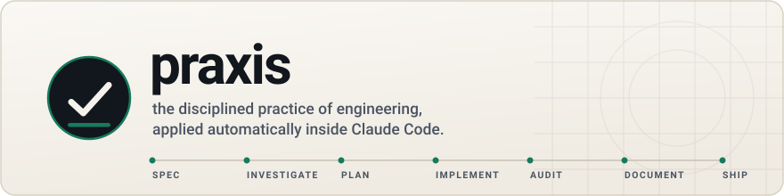
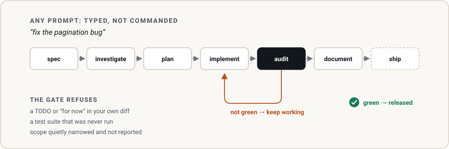
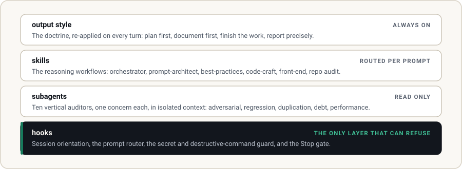

<p align="center">
  
</p>

<p align="center">
  <a href="https://github.com/Ohswedd/praxis/actions/workflows/release.yml"></a>
  <a href="https://github.com/Ohswedd/praxis/releases/latest"></a>
  
  
  <a href="LICENSE">
  </a>
</p>

Claude Code will happily tell you a change is done. Praxis is the part that
disagrees. It turns the review you would otherwise retype into every prompt:
*read the docs first, reuse what exists, try to break it, check what it broke,
finish it*, into behaviour that lives in the session lifecycle, and it holds a
turn open until the work actually holds up.

*Praxis* is theory enacted: the point at which principles stop being advice and
become what you do.

**Contents** ·
[Install](#install) · [How it works](#how-it-works) · [What you get](#what-you-get) ·
[Commands](#commands) · [Configuration](#configuration) · [Safety](#safety) ·
[Docs](#documentation)

## Install

```
/plugin marketplace add Ohswedd/praxis
/plugin install praxis@ohswedd-praxis
```

Then describe what you want: *"fix the pagination bug"*, *"integrate Stripe"*,
and pick your effort (`/effort high`, or `ultracode`). There is genuinely no
command to remember. The `praxis-quality` output style enables itself with the
plugin, a prompt router engages the right skills from how you phrased the
request, and in a repo Praxis has not set up it bootstraps first and then gets on
with your actual request in the same turn.

Requires **Claude Code** (v2.1.139+ recommended) and **Python 3.8+** on `PATH`.
Hooks are standard-library only, no pip installs, no third-party supply chain.
macOS and Linux work out of the box; on Windows, ensure `python3` resolves.

> **Installed before v1.5.1?** The marketplace was renamed `praxis` →
> `ohswedd-praxis`, because an unrelated project publishes one under the old name
> and Claude Code keeps only one marketplace per name. Run
> `/plugin marketplace remove praxis`, then the commands above. The plugin and
> every `/praxis:*` command are unchanged.

## How it works

You state the idea. Praxis sizes the request, runs the pipeline, and refuses to
call it finished until the audit is green.

<p align="center">
  
</p>

The gate is the part that matters. It is a Stop hook, not a suggestion: while the
tree has unreviewed changes, the turn does not end. Refusals escalate, first the
workflow, then the specific evidence that is missing, then a demand that you
either finish or tell the user plainly that the change is going out unaudited.
Two caps and a fail-open path guarantee it can never trap a session.

Four layers, only one of which has authority:

<p align="center">
  
</p>

## Workflows

Four shapes of request, four workflows. You do not choose between them: the
router reads what you typed, and the gate resolves the rest from the files you
actually changed.

<p align="center">
  
</p>

| You type | What runs | Where it stops |
| --- | --- | --- |
| *"fix the pagination bug"* | spec → investigate → plan → implement → 7 auditors → docs | a green report whose test run Praxis executed itself |
| *"build the pricing page"* | brief → wireframes → design system → build → 9 auditors | the same, plus the accessibility and design-consistency verdicts |
| *"update `Header.tsx`"* | the front-end route, from the file name alone | as above: naming a `.tsx` file is enough to make it design work |
| *"why is this slow?"* | nothing. It is a question | Praxis answers it and stays out of the way |
| *"audit the whole repo"* | shard ledger → every dimension → reverse audit → fixes | a coverage report computed from the ledger, gaps stated |
| *"commit this and open a PR"* | Conventional Commit → branch → PR body → merge policy | the PR, unless you turned auto-merge on |

Every skill and every auditor, and the one thing that makes each of them run:

<p align="center">
  
</p>

## What you get

### It engages without being asked

A `UserPromptSubmit` router reads each request and names the skills it needs, so
a bare *"fix the checkout page"* runs the same pipeline as `/praxis:task`:
including the front-end pipeline and the UI auditors when the request touches an
interface. Questions, slash commands and acknowledgements are left alone.

### It sets the repo up before it works in it

Open a repository Praxis does not manage and it does not suggest a setup command:
it maps the repo read-only, writes the operating brief, the guardrails and the
living-knowledge scaffolding, reports it in a line, and continues to the thing you
actually asked for. It stops to ask about exactly one step, reconciling a
`CLAUDE.md` it did not author, because that merge is the only one that can lose
an instruction. Questions never trigger it, and `/praxis:config bootstrap off`
turns it off per repo.

### It knows when the repo isn't yours

Praxis writes real files into a project: a brief, settings, `/docs`, a changelog,
ADRs. In your own repository that is the point. In one you are only contributing
to, every one of them is a file the maintainers never asked for, sitting one
`git add -A` away from a pull request that should have contained a bug fix.

So Praxis works out whose repository it is, offline, from git alone: a remote,
real history, and not one commit from your git address means you cloned somebody
else's project. Everything uncertain resolves to `owner`, and
`/praxis:config mode owner|contributor|auto` overrides the verdict, which the
session audit prints with its reason every time. The verdict is pinned once
reached, so the commit you came to make cannot quietly turn the repo back into
"yours".

In `contributor` mode the brief becomes `CLAUDE.local.md`, settings become
`.claude/settings.local.json`, and `/docs`, `CHANGELOG.md`, `docs/adr/` and
`docs/design/` are joined **only if the project already has them**, on its terms,
and otherwise kept under `.claude/.praxis/knowledge/`. A project that keeps a
changelog expects your PR to update it; a project without one did not ask a
contributor to introduce the convention.

<p align="center">
  
</p>

Containment does not rely on remembering. A marked block in
`$GIT_COMMON_DIR/info/exclude`, the file git reserves for per-clone patterns that
are never shared, makes the artifacts invisible to `git status` and unreachable
by `git add -A`. The PreToolUse guard refuses to stage them by name even with
`-f`, refuses a forced stage-everything outright, and refuses to write a Praxis
path into a `.gitignore` that isn't ours. And because a command string can always
be written another way, the last layer asks git rather than the text: a `commit`,
`push` or `stash` is refused while a Praxis artifact is in the index, however it
got there.

### It refuses to hand back unfinished work

| Refused | Detected by |
| --- | --- |
| A `TODO`, stub, or `NotImplementedError` in your own diff | deterministic scan of both diffs **and every untracked file**, so a brand-new file is not invisible | <!-- praxis:ack naming the marker is the point here -->
| Deferral prose: *"for now"*, *"in a real implementation"*, *"future work will"* | comment-level scan; `praxis:ack` exempts a genuine case |
| A test suite that was never run | `report.py` executes the suite itself and records the real exit code |
| Scope quietly narrowed | the completeness auditor checks the change against its own spec |
| A UI change with no accessibility or design-consistency verdict | the gate resolves "is this UI" from the changed file list, not from how you phrased it |
| An em dash, anywhere in the text you wrote | `scan_style.py`, because a colon or a comma always says it better |
| `Co-Authored-By: Claude` or a "generated with" credit | the PreToolUse guard blocks the `git commit` or `gh pr create` outright | <!-- praxis:ack: naming the trailer is the point here -->

Unless you ask for a prototype, the deliverable is the finished product: error
handling and the states you know are needed are in scope, not follow-ups.
"Out of scope" is for what you excluded, not for what it ran out of patience for.

### It audits like an adversary

Ten read-only subagents, each with one concern and its own context:
**adversarial**, **regression**, **duplication** (including over-engineering),
**performance**, **edge-case**, **doc-reference**, **debt**, **completeness**,
plus **accessibility** and **design-consistency** whenever a change touches UI. A
horizontal pass then checks the change reads as one coherent whole, and the loop
repeats until every vertical is green.

The **debt** vertical is the only one that asks about later rather than now:
what this change will cost to live with, and, above all, whether the shortcuts it
took were written down. A shortcut with a stated reason is a decision; the same
shortcut unrecorded is the defect, because the next person meets the consequence
without the reason. `debt.py` keeps that register in `docs/DEBT.md` and refuses an
entry that does not say what it costs and what would repay it.

### It reviews the branch, not the working tree

One `git commit` used to end a review: `git diff` goes empty, the tree is clean,
and every scanner, auditor and gate sees nothing. The better the delivery
discipline, the more complete that blindness became. The review scope is now
everything the branch has done since it left its base, plus what is still
uncommitted, plus untracked files. `scope.py` prints it, and the regression
auditor reads the commits **in order**, because a signature changed in one commit
and its callers updated in another is a story a squashed diff cannot tell.

`/praxis:audit repo` applies the same auditors to an entire existing codebase,
shard by shard, adversarially re-verifying every finding before acting on it and
reporting coverage honestly.

### It designs, not just complies

The front-end pipeline runs business research → story-first wireframes → design
system → build → optimize, for any niche. Its craft reference names the tells of
generated UI: centered everything, the violet gradient hero, three equal cards,
a rocket icon standing in for evidence, lorem ipsum, and treats them as defects
rather than taste. Invented proof (a fabricated quote, logo, rating, or metric)
is a hard failure.

### It keeps the project's knowledge alive

Every behaviour, API, config or architecture change updates `/docs`, adds a
`CHANGELOG.md` entry, and records an ADR when the decision was significant or
taken autonomously. The `CLAUDE.md` hierarchy is kept current and
regression-verified: proposed as diffs, never silently overwritten.

Documentation rots in one particular way, so Praxis checks for that one
particularly. A doc that states a setting's behaviour as a constant ("Praxis
opens the PR and a human merges") is wrong the moment you flip the setting, and
it then reads as authoritative for every session after. `drift.py` compares what
the docs assert against the configuration actually in force, and against the
commands, links and files that actually exist; the session audit states the
resolved values every session, so no turn has to trust a document at all.

### It can run the whole thing unattended

`/praxis:config autopilot on` stops the questions: Praxis resolves each design
decision by the best-practice that fits and records it under *Decisions taken
autonomously*. Safety guards stay active regardless. For a long task it opens a
self-driving task so the session runs to completion: you never manage `/goal`.

> Praxis is built for quality over cost, and runs entirely in the interactive
> session, so a Claude Pro/Max subscription covers it. See
> [`docs/USAGE.md`](docs/USAGE.md) for why it avoids the headless path.

## Commands

You rarely need these: the router and the gate apply the pipeline on their own.
Eight commands, each with one job; several take a mode as their argument rather
than existing as a command of their own.

| Command | What it does |
| --- | --- |
| `/praxis:task <request>` | run the full pipeline end to end. Prefix `spec:` to stop at the spec |
| `/praxis:audit [repo\|path]` | the quality rubric on the current branch's change, or the whole repo |
| `/praxis:docs` | update `/docs`, `CHANGELOG.md`, ADRs and the brief hierarchy |
| `/praxis:ship [release]` | Conventional Commit → branch → PR, or cut a SemVer release |
| `/praxis:bootstrap` | set up or migrate this repo (it also runs on its own) |
| `/praxis:doctor` | diagnose setup health and documentation drift |
| `/praxis:config [mode\|switch]` | show or set the workspace mode, auto-pilot, auto-merge, auto-bootstrap, the gate |
| `/praxis:discover` | find or create a missing capability |

<details>
<summary>Removed in 3.0 (one command, no lost workflow)</summary>

| Was | Now |
| --- | --- |
| `/praxis:frontend <request>` | nothing to type. The front-end pipeline is engaged by the surface a change touches, through the prompt router, the task-orchestrator, and the gate | <!-- praxis:ack: a migration table names the old command on purpose -->

Every phase, artifact and auditor is unchanged. What went is the fourth way to
start the pipeline, and it was the only one that could be used wrongly: typed
after the design decisions were made, or not typed at all for the *"fix the
checkout bug"* that was front-end work all along.

</details>

<details>
<summary>Moved in 2.0 (five commands folded into four)</summary>

| Was | Now |
| --- | --- |
| `/praxis:spec <request>` | `/praxis:task spec: <request>` | <!-- praxis:ack: a migration table names the old command on purpose -->
| `/praxis:scan [path]` | `/praxis:audit repo` or `/praxis:audit <path>` | <!-- praxis:ack -->
| `/praxis:sync` | `/praxis:docs`, which now covers `CLAUDE.md` too | <!-- praxis:ack -->
| `/praxis:release [version]` | `/praxis:ship release [version]` | <!-- praxis:ack -->
| `/praxis:autopilot on\|off` | `/praxis:config autopilot on\|off` | <!-- praxis:ack -->

The workflows themselves are unchanged: the same skills run, under fewer
entry points. `autopilot.py` and `git_delivery.py` became `config.py`, which also
toggles the gate and reports where each resolved value came from.

</details>

## Configuration

Optional, version-controlled `.praxis.toml`, every key has a default:

```toml
[workspace]
mode          = "auto"   # "auto" | "owner" | "contributor"

[bootstrap]
auto          = true     # set an unmanaged repo up before working in it

[gate]
enabled             = true   # the Stop quality/task gate
require_tests       = true   # a green report must record a passing test run
require_ui_verticals = true  # a UI change needs the a11y + design verdicts

[autopilot]
default       = false    # start sessions in auto-pilot

[audit]
depth         = "high"   # auditor depth: "high" | "max"

[git]
auto_merge     = false   # off: open the PR and let a human merge
default_branch = ""      # PR base ("" auto-detects origin/HEAD, then main/master)

[style]
ban_em_dash        = true  # refuse em dashes in authored text
ban_ai_attribution = true  # refuse AI co-author and generated-by credits
```

`/praxis:config` prints every one of these as resolved, and names the source, so
a surprising value is always traceable. Session escapes: `PRAXIS_MODE=owner`,
`PRAXIS_GATE=off`, `PRAXIS_AUTOPILOT=on`, `PRAXIS_AUTO_MERGE=on`,
`PRAXIS_BOOTSTRAP=off`, and `touch .claude/.praxis/skip-gate`. A second copy of
this file at `.claude/.praxis/praxis.toml` is read afterwards and overrides it;
it is git-excluded, and it is the only one Praxis writes in `contributor` mode.
The full stable surface is in [`docs/STABILITY.md`](docs/STABILITY.md).

## Safety

Installing any plugin runs its code on your machine. Praxis is deliberately
conservative about that:

- **A guard that holds under `--dangerously-skip-permissions`.** A PreToolUse hook
  blocks secret-file access, force-pushes, destructive resets, broad `rm -rf`, and
  secret exfiltration. It is a backstop: your permission settings remain the
  primary control.
- **Read-only auditors.** The nine vertical subagents get `Read, Grep, Glob` and
  nothing else (doc-reference also has web search).
- **Additive setup, never a silent overwrite.** Bootstrap writes what is absent
  and stops to ask before reconciling a brief it did not author; valid
  instructions are never silently dropped.
- **Nothing of Praxis's reaches a repo that isn't yours.** In `contributor` mode
  every artifact it writes is local and git-excluded, and the guard refuses to
  stage one even when asked directly.
- **Human-in-the-loop delivery.** With `git.auto_merge` off, which is the default,
  Praxis opens the PR and stops. It never force-pushes, and never merges without a
  green audit even when you do opt in.
- **The history stays yours.** No AI co-author trailer, no "generated with"
  footer, in any commit, tag, PR, release, or issue. The guard blocks the command
  rather than trusting the reminder.
- **Fail-open hooks.** If a hook errors, the session continues.
- **No shipped secrets, no live MCP.** MCP wiring is a template referencing
  environment variables.

- **No data collection.** Praxis has no backend, makes no network calls, and
  sends nothing to its author: see [`PRIVACY.md`](PRIVACY.md).

Full posture in [`SECURITY.md`](SECURITY.md).

## Documentation

| | |
| --- | --- |
| [`ARCHITECTURE.md`](docs/ARCHITECTURE.md) | the design, layer by layer |
| [`FLOWS.md`](docs/FLOWS.md) | diagrams, worked examples, edge cases, traceability |
| [`MODES.md`](docs/MODES.md) | workspace mode, auto-bootstrap, effort, auto-pilot, `/goal` |
| [`FRONTEND.md`](docs/FRONTEND.md) | the front-end pipeline and its craft reference |
| [`AUDIT.md`](docs/AUDIT.md) | Praxis audited against itself, findings and fixes |
| [`KNOWLEDGE.md`](docs/KNOWLEDGE.md) | the living-knowledge model |
| [`DELIVERY.md`](docs/DELIVERY.md) | the Git/GitHub delivery model |
| [`STABILITY.md`](docs/STABILITY.md) | the stable public surface under SemVer |
| [`INSTALL.md`](docs/INSTALL.md) · [`USAGE.md`](docs/USAGE.md) | setup and day-to-day use |

To work on Praxis itself, see [`CONTRIBUTING.md`](CONTRIBUTING.md). It holds
itself to the standards it enforces: every push is CI-verified for manifest
validity, plugin self-integrity, and the full test suite.

## License

MIT: see [LICENSE](LICENSE).
