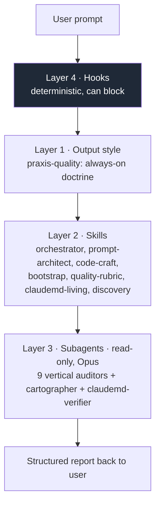
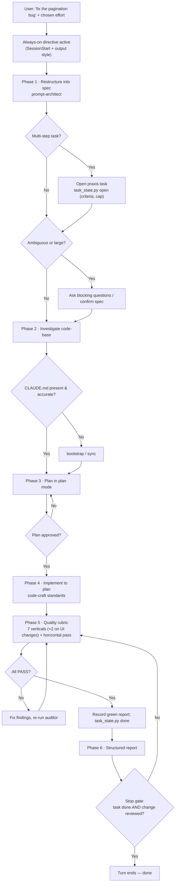
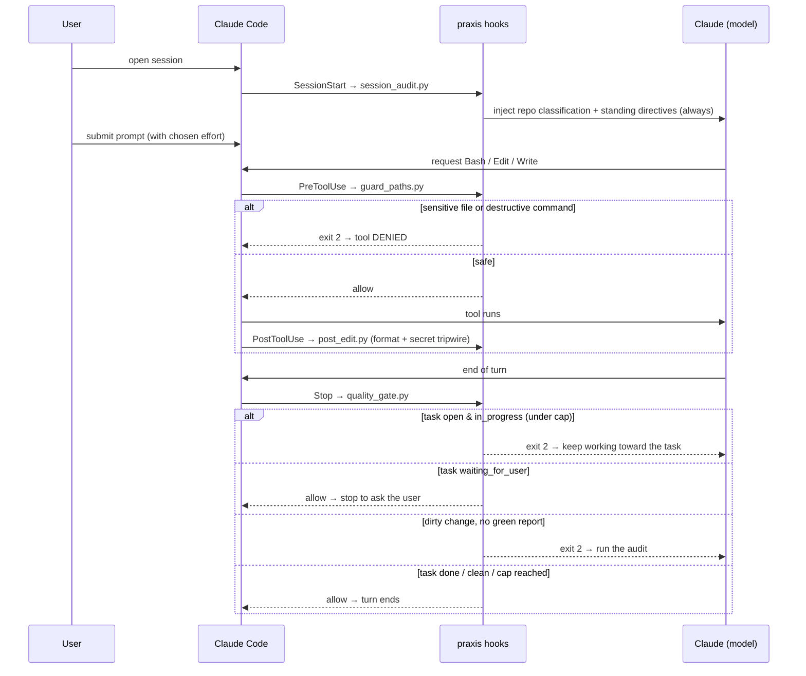
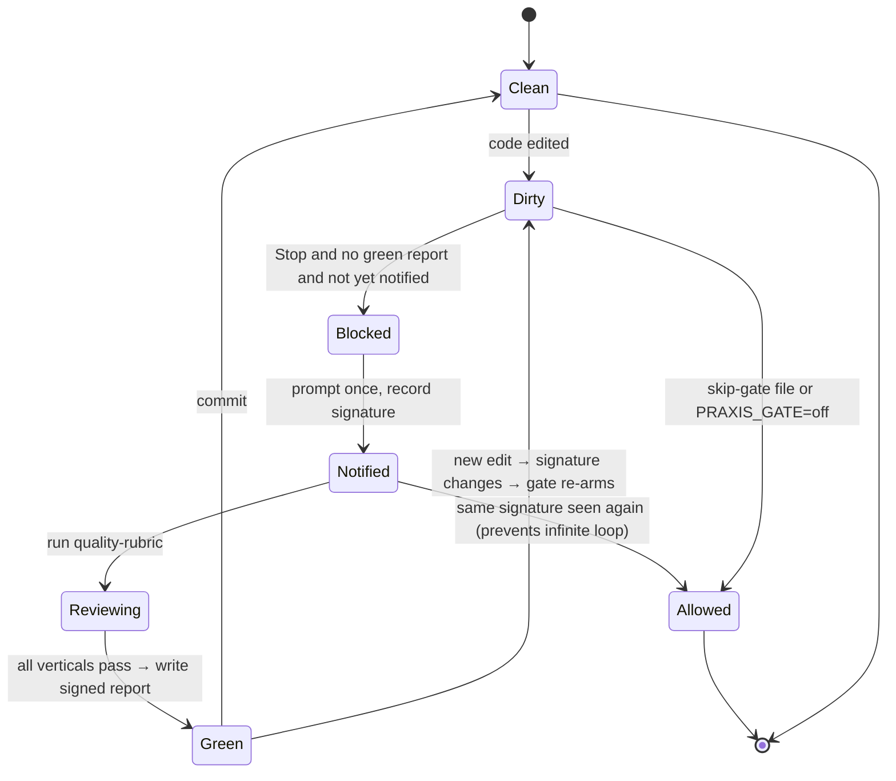
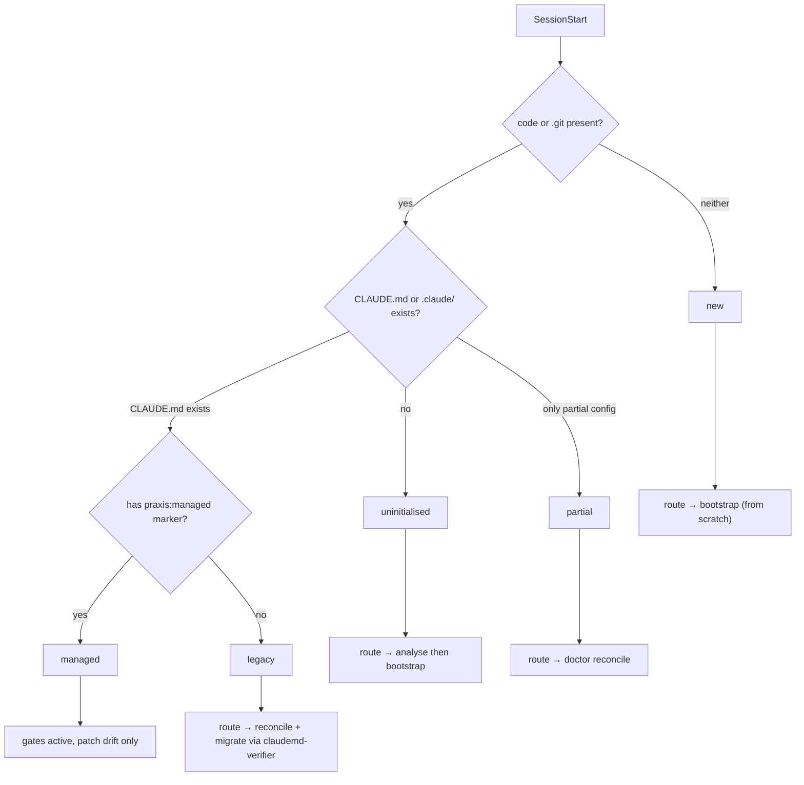

# Praxis — Flows, Examples & Verification

This document explains how praxis behaves end-to-end so you can verify it does
what it should. It covers: the system map, the pipeline, the hook lifecycle, the
gate state machine, worked examples, edge cases, a requirement→component
traceability matrix, and an honest account of what is **hard-enforced** vs
**guided**.

---

## 1. System map — the four layers

- **Hooks** are the only layer that can *block*. Everything else shapes behaviour.
- The **output style** keeps the mindset on without spending a user turn.
- **Skills** carry the multi-step reasoning and load only when relevant.
- **Subagents** run deep, verbose analysis in their own context, read-only.

---

## 2. The end-to-end pipeline

What happens when you type an implementation request:

The Stop gate is what makes this self-driving: while a task is open it keeps
Claude working (turn cap enforced), and it independently refuses to finish while a
change is unreviewed. No prompt keyword and no `/goal` are involved.

---

## 3. Hook lifecycle (who fires when)

---

## 4. Quality-gate state machine

The **change signature** = `sha256(HEAD + dirty file list + sizes/mtimes)`. A
green report is valid only for the exact signature it was produced against, so
editing again automatically re-arms the gate.

---

## 5. Onboarding classifier (every SessionStart)

---

## 6. Worked examples

### Example A — Simple fix from a one-line prompt

**You type:** `fixami il bug di paginazione nella lista utenti`

1. **Always-on:** the SessionStart directive + output style are already in
   context, and `UserPromptSubmit` routes this prompt as an `implement` request —
   injecting the `task-orchestrator` pipeline by name, so the workflow engages
   without a keyword trigger or `/goal`. Claude opens a praxis task with the
   acceptance criteria.
2. **Restructure (prompt-architect):**
   - Goal: pagination returns correct pages for the users list.
   - In scope: the paging logic + a regression test.
   - Out of scope: redesigning the list UI.
   - Acceptance: page N returns items `[N*size .. N*size+size)`; existing tests
     still pass; boundary (last partial page, empty result) correct.
3. **Investigate:** reads the users-list module + its tests; `doc-reference-finder`
   confirms the ORM's pagination API for the version in use.
4. **Plan (plan mode):** "off-by-one in offset calc in `users.repo.ts:42`; fix +
   add tests for empty and last-page cases." You approve.
5. **Implement:** fixes offset; adds tests; `code-craft` → comment explains *why*
   the boundary is inclusive/exclusive. `PostToolUse` auto-formats.
6. **Audit:** regression-sentinel (callers unaffected), edge-case-hunter (empty /
   last page covered), completeness (no TODO left) → all PASS; tests green.
7. **Report:** what changed, criteria met, audit table, tests, out-of-scope
   (none), assumptions (none). Stop gate sees the green report → turn ends.

### Example B — Larger integration

**You type:** `integrami Stripe checkout nel flusso di pagamento`

- Restructure surfaces **out of scope** explicitly (e.g. "refunds and webhooks
  retry not included") so you aren't surprised later.
- Investigate finds no payment module → `capability-discovery` checks for an
  existing Stripe MCP/SDK **before** scaffolding; `doc-reference-finder` pins the
  current Stripe API version.
- Plan lists every file, the new env vars (referenced, never hard-coded), and the
  test doubles. You approve.
- Implement + audit: adversarial-auditor checks the webhook signature
  verification and that secrets aren't logged; completeness-auditor verifies the
  success/cancel/error branches are all implemented, not stubbed.
- Report ends with "Out of scope / follow-ups: webhook retry, refund flow" — in
  writing, not hidden.

### Example C — A question (pipeline does NOT trigger)

**You type:** `come funziona la paginazione qui?`

- A question changes no files, so no task is opened and the Stop gate stays quiet;
  Claude answers normally. No plan, no gate, no overhead. The gates key off real
  file changes, not the words in the prompt.

---

## 7. Edge cases & how the system handles them

| Edge case | Behaviour |
| --- | --- |
| **Ambiguous prompt** | prompt-architect surfaces open questions; asks only if blocking, else states an assumption and proceeds. |
| **Legacy CLAUDE.md** (other tool) | classified `legacy`; bootstrap **merges** and routes through `claudemd-verifier` + `claudemd_check.py` so no valid instruction is lost. |
| **Model tries to leave a `TODO`/stub** | `scan_placeholders.py` flags it in the diff; completeness-auditor FAILs; Stop gate lists the exact `file:line` and refuses to finish. |
| **Silently narrowed scope** | completeness-auditor compares delivery vs acceptance criteria and flags anything dropped; report must list it under Out-of-scope. |
| **Reading `.env` / secrets** | PreToolUse `guard_paths` denies (exit 2) — even under `--dangerously-skip-permissions`; `.env.example` is allowed. |
| **Destructive command** (`rm -rf /`, force-push to main, `curl \| bash`) | PreToolUse denies with the reason. |
| **Secret written into a file** | PostToolUse tripwire warns loudly (can't undo a write, so prevention is at PreToolUse). |
| **Stop-gate infinite loop risk** | gate prompts **once per signature per session**; the second time the same state is seen it allows — no trap. |
| **Trivial change / no code edited** | gate only fires on a dirty git tree; clean tree or Q&A → no gate. |
| **You intentionally want to stop early** | `touch .claude/.praxis/skip-gate` (repo) or `PRAXIS_GATE=off` (session). |
| **A hook script errors** | every hook is fail-open: on exception it exits 0, so the session never breaks because of praxis. |
| **Not a git repo** | gate and signature logic no-op; guards and bootstrap still work. |
| **No formatter installed** | PostToolUse formatting skips silently; nothing fails. |
| **A question, not a task** | The prompt router stays silent on interrogatives, slash commands, and acknowledgements — no routing noise. |
| **The audit genuinely can't finish** | The gate escalates 3× then releases, having instructed Claude to tell you the change is unaudited and what to check. |
| **A deferral phrase is legitimate** | Annotate the line `praxis:ack`; the scanner records the acknowledgement in the code and exempts it. |
| **Windows / no `python3`** | hooks need `python3` on PATH; on Windows adjust the hook commands to `python` (documented in INSTALL). |

---

## 8. Requirement → component traceability

Your stated goals mapped to what implements them:

| Your requirement | Implemented by | Enforcement |
| --- | --- | --- |
| Restructure a terse prompt | `prompt-architect` skill + always-on SessionStart directive | Guided |
| Read the code-base first | `task-orchestrator` Phase 2 + `repo-cartographer` | Guided |
| Have the right CLAUDE.md | `bootstrap` + `claudemd-living` + `session_audit` | Guided + classified |
| Plan mode before code | output-style + orchestrator Phase 3 | **Guided (not a hard block)** |
| Keep working until the task is done | `quality_gate.py` task loop + `task.json` (no `/goal` needed) | **Deterministic** |
| Invoke the right agents/skills | `prompt_router.py` (UserPromptSubmit) names them per request + `quality-rubric` orchestration + skill descriptions | **Deterministic routing**, guided execution |
| Finish it, don't ship an MVP | `scan_placeholders.py` deferral detection + escalating Stop gate + completeness-auditor | **Deterministic block** |
| A designed UI, not a generic one | `frontend-pipeline` `reference/craft.md` + design-consistency-auditor §9 | Guided, gated by report |
| Professional comments | `code-craft` skill | Guided |
| Redo all audits, no regression | `quality-rubric` + 7 vertical subagents (+ accessibility & design-consistency on UI changes) | Guided, gated by report |
| Professional front-end for any niche | `frontend-pipeline` skill + design artifacts (`docs/design/`) + a11y/design-consistency verticals | Guided, gated by report |
| No placeholders / nothing missing | `completeness-auditor` + `scan_placeholders.py` | **Deterministic scan + gate** |
| Nothing silently out of scope | prompt-architect (declare) + completeness-auditor (verify) + report | Guided + checked |
| Don't finish unreviewed work | `quality_gate.py` (Stop hook) | **Deterministic block** |
| Secrets / destructive safety | `guard_paths.py` (PreToolUse) | **Deterministic block** |
| Precise structured output | output-style + orchestrator report template | Guided |
| Audit/fix an entire existing repo | `repo-audit` skill + `repo_scan.py` ledger + `finding-verifier` reverse audit | Guided, **coverage tracked deterministically** |

---

## 9. What is hard-enforced vs guided (read this)

Being honest so you can trust it correctly:

**Deterministic (the machine guarantees it):**
- Sensitive-file and destructive-command **blocking** (PreToolUse, holds even
  under `--dangerously-skip-permissions`).
- The Stop gate **will not let a turn end** while the git tree is dirty and no
  signed green report matches the current state.
- The placeholder/incompleteness **scan** of the diff is exact grep — it will find
  TODO/FIXME/NotImplemented/stub/debug markers regardless of the model.
- Auto-format on save; secret tripwire; session classification.

**Guided (the model performs it; praxis structures and prompts it, and the gate
refuses to pass until the green report exists):**
- Restructuring, investigation, planning, code-craft, and the *quality of* the
  vertical audits. These are LLM work. praxis makes them the default and gates
  the finish on a green report — but it relies on the model actually running the
  rubric to earn that report. The deterministic backstops above are what catch the
  worst failures if it doesn't.

**Known limitations / honest gaps:**
1. **Plan-mode is not a hard block.** praxis strongly directs "plan before
   editing" but does not deterministically forbid the first edit, because
   "non-trivial" can't be judged reliably in a pre-edit hook without false
   blocks. If you want a hard stop, that would be a `PreToolUse` rule you accept
   may over-fire.
2. **The green report is trust-based.** The Stop gate checks the report exists and
   matches the signature; it can't verify the audit reasoning was genuine. A
   cooperative model earns it honestly; the deterministic scans are the safety
   net.
3. **Intent is not classified from the prompt.** praxis no longer guesses
   "is this an implementation request" from keywords. Instead the workflow
   directive is always present and enforcement is change-based, so behaviour is
   deterministic regardless of phrasing. The trade-off: the always-on directive is
   in context every session (a small, fixed context cost) rather than injected
   selectively.
4. **Auditors are advisory + read-only.** They find issues; the main agent fixes
   them. Fix quality depends on the model.
5. **Environment assumptions:** `python3` on PATH; formatters only run if
   installed; `prompt`/`agent` native hook types are intentionally *not* used
   (only universally-documented `command` hooks), so the LLM gate is enforced via
   the marker file rather than a native LLM hook.

---

## 10. Recommended live verification (do this once)

Logic is validated in isolation; the real proof is a 5-minute smoke test inside
Claude Code:

1. Install locally: `/plugin marketplace add ./` → `/plugin install praxis@praxis`.
2. `/praxis:doctor` → confirms version + health.
3. Open a repo with a `.env` and ask Claude to read it → guard should deny.
4. Ask `crea una funzione X` → confirm the pipeline directive appears and a plan
   is proposed before edits.
5. Have it leave a `# TODO` deliberately, then stop → the Stop gate should block
   and list the marker.
6. Run `/praxis:audit` → confirm the verdict table + report.
7. `touch .claude/.praxis/skip-gate` → confirm the gate now allows stopping.

If all seven behave as described above, the harness is wired correctly.
