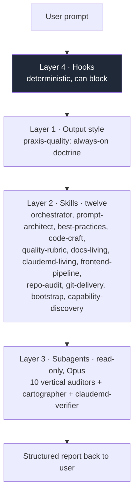
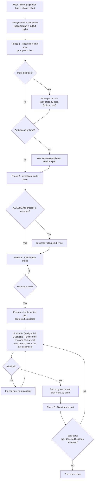
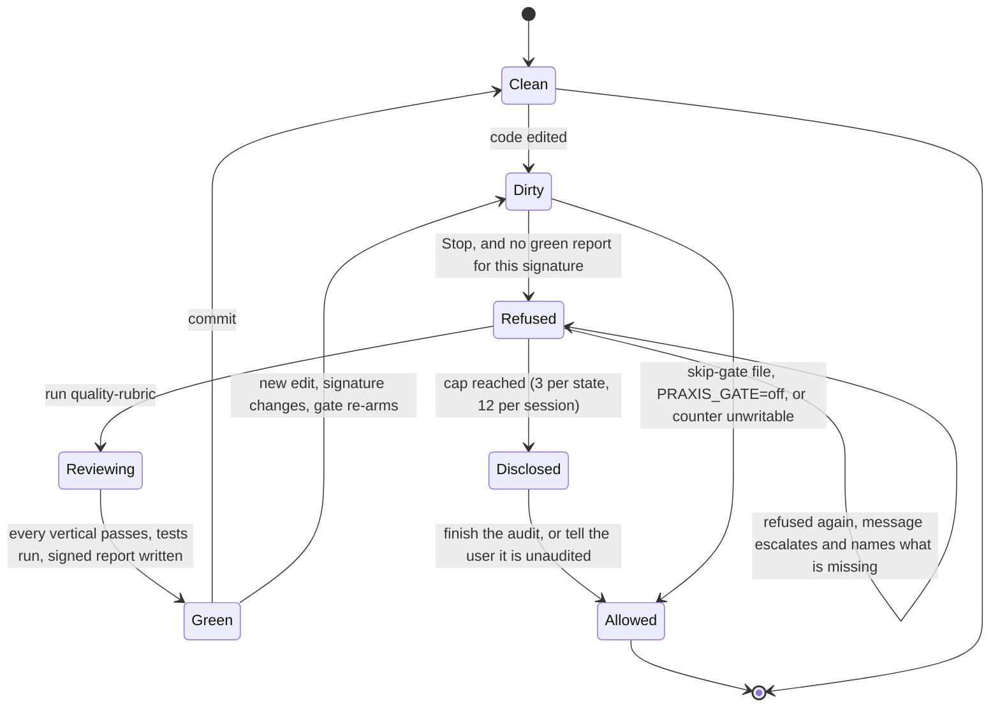
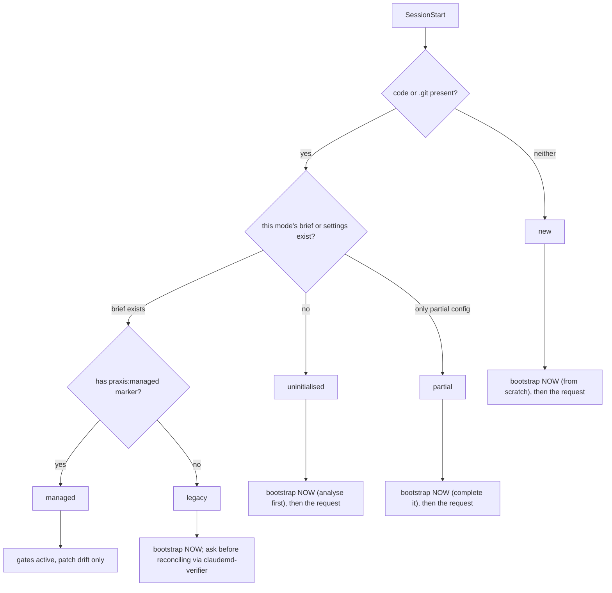
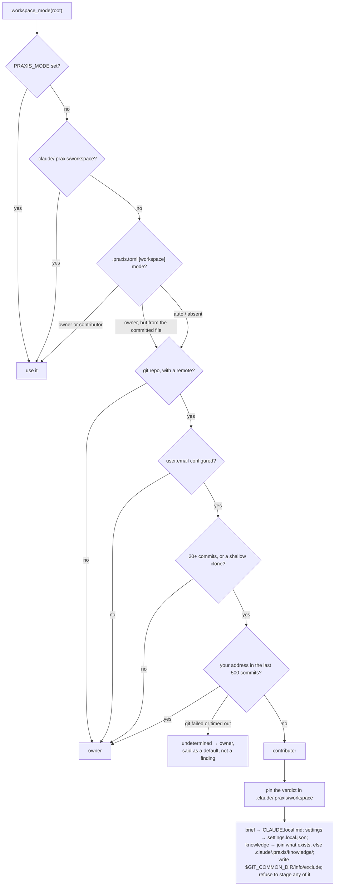

# Praxis: Flows, Examples & Verification

This document explains how praxis behaves end-to-end so you can verify it does
what it should. It covers: the system map, the pipeline, the hook lifecycle, the
gate state machine, worked examples, edge cases, a requirement→component
traceability matrix, and an honest account of what is **hard-enforced** vs
**guided**.

---

## 1. System map: the four layers

```mermaid
flowchart TB
    U["User prompt"] --> H1["Layer 4 · Hooks<br/>deterministic, can block"]
    H1 --> OS["Layer 1 · Output style<br/>praxis-quality: always-on doctrine"]
    OS --> SK["Layer 2 · Skills · twelve<br/>orchestrator, prompt-architect, best-practices, code-craft,<br/>quality-rubric, docs-living, claudemd-living, frontend-pipeline,<br/>repo-audit, git-delivery, bootstrap, capability-discovery"]
    SK --> AG["Layer 3 · Subagents · read-only, Opus<br/>10 vertical auditors + cartographer + claudemd-verifier"]
    AG --> OUT["Structured report back to user"]

    classDef det fill:#1f2937,color:#fff;
    class H1 det;
```

- **Hooks** are the only layer that can *block*. Everything else shapes behaviour.
- The **output style** keeps the mindset on without spending a user turn.
- **Skills** carry the multi-step reasoning and load only when relevant.
- **Subagents** run deep, verbose analysis in their own context, read-only.

---

## 2. The end-to-end pipeline

What happens when you type an implementation request:

```mermaid
flowchart TD
    A["User: 'fix the pagination bug' + chosen effort"] --> C["Always-on directive active<br/>(SessionStart + output style)"]
    C --> D["Phase 1 · Restructure into spec<br/>prompt-architect"]
    D --> D2{"Multi-step task?"}
    D2 -->|Yes| D3["Open praxis task<br/>task_state.py open (criteria, cap)"]
    D2 -->|No| E
    D3 --> E{"Ambiguous or large?"}
    E -->|Yes| F["Ask blocking questions / confirm spec"]
    E -->|No| G["Phase 2 · Investigate code-base"]
    F --> G
    G --> H{"CLAUDE.md present & accurate?"}
    H -->|No| I["bootstrap / claudemd-living"]
    H -->|Yes| J["Phase 3 · Plan in plan mode"]
    I --> J
    J --> K{"Plan approved?"}
    K -->|No| J
    K -->|Yes| L["Phase 4 · Implement to plan<br/>code-craft standards"]
    L --> M["Phase 5 · Quality rubric<br/>8 verticals (+2 when the changed files are UI)<br/>+ horizontal pass + the three scanners"]
    M --> N{"All PASS?"}
    N -->|No| O["Fix findings, re-run auditor"]
    O --> M
    N -->|Yes| P["Record green report; task_state.py done"]
    P --> Q["Phase 6 · Structured report"]
    Q --> R{"Stop gate:<br/>task done AND change reviewed?"}
    R -->|No| M
    R -->|Yes| S["Turn ends: done"]
```

The Stop gate is what makes this self-driving: while a task is open it keeps
Claude working (turn cap enforced), and it independently refuses to finish while a
change is unreviewed. No prompt keyword and no `/goal` are involved.

---

## 3. Hook lifecycle (who fires when)

```mermaid
sequenceDiagram
    participant U as User
    participant CC as Claude Code
    participant CF as praxis hooks
    participant CL as Claude (model)

    U->>CC: open session
    CC->>CF: SessionStart → session_audit.py
    CF->>CF: resolve workspace mode; in contributor, write $GIT_COMMON_DIR/info/exclude
    CF->>CL: inject mode, repo classification, bootstrap instruction, directives

    U->>CC: submit prompt (with chosen effort)
    CC->>CF: UserPromptSubmit → prompt_router.py
    CF->>CL: skills for this request (+ bootstrap first, if not managed)
    CL->>CC: request Bash / Edit / Write
    CC->>CF: PreToolUse → guard_paths.py
    alt sensitive file, destructive command, or staging a praxis artifact
        CF-->>CC: exit 2 → tool DENIED
    else safe
        CF-->>CC: allow
        CC->>CL: tool runs
        CC->>CF: PostToolUse → post_edit.py (format + secret tripwire)
    end

    CL->>CC: end of turn
    CC->>CF: Stop → quality_gate.py
    alt task open & in_progress (under cap)
        CF-->>CL: exit 2 → keep working toward the task
    else task waiting_for_user
        CF-->>CC: allow → stop to ask the user
    else dirty change, no green report
        CF-->>CL: exit 2 → run the audit
    else task done / clean / cap reached
        CF-->>CC: allow → turn ends
    end
```

---

## 4. Quality-gate state machine

```mermaid
stateDiagram-v2
    [*] --> Clean
    Clean --> Dirty: code edited
    Dirty --> Refused: Stop, and no green report for this signature
    Refused --> Refused: refused again, message escalates and names what is missing
    Refused --> Reviewing: run quality-rubric
    Reviewing --> Green: every vertical passes, tests run, signed report written
    Green --> Clean: commit
    Green --> Dirty: new edit, signature changes, gate re-arms
    Refused --> Disclosed: cap reached (3 per state, 12 per session)
    Disclosed --> Allowed: finish the audit, or tell the user it is unaudited
    Dirty --> Allowed: skip-gate file, PRAXIS_GATE=off, or counter unwritable
    Allowed --> [*]
    Clean --> [*]
```

The **change signature** = `sha256(HEAD + dirty file list + sizes/mtimes)`. A
green report is valid only for the exact signature it was produced against, so
editing again automatically re-arms the gate.

---

## 5. Onboarding classifier (every SessionStart)

The brief it looks for is whichever one this workspace mode owns: `CLAUDE.md` in
`owner`, `CLAUDE.local.md` in `contributor`. So a bootstrapped contributor clone
reads as `managed` while the project's own `CLAUDE.md`, if it has one, is never
counted and never touched.

```mermaid
flowchart TD
    A["SessionStart"] --> B{"code or .git present?"}
    B -->|neither| N["new"]
    B -->|yes| C{"this mode's brief or settings exist?"}
    C -->|no| U["uninitialised"]
    C -->|brief exists| D{"has praxis:managed marker?"}
    D -->|yes| M["managed"]
    D -->|no| L["legacy"]
    C -->|only partial config| P["partial"]
    N --> RN["bootstrap NOW (from scratch), then the request"]
    U --> RU["bootstrap NOW (analyse first), then the request"]
    L --> RL["bootstrap NOW; ask before reconciling via claudemd-verifier"]
    M --> RM["gates active, patch drift only"]
    P --> RP["bootstrap NOW (complete it), then the request"]
```

Anything but `managed` produces an **instruction**, not a suggestion, repeated by
the prompt router on every actionable prompt (conversational prompts stay
silent). `bootstrap.auto = false` turns it off per repo. See ADR-0018.

---

## 5b. Workspace mode (resolved before anything is written)

```mermaid
flowchart TD
    A["workspace_mode(root)"] --> B{"PRAXIS_MODE set?"}
    B -->|yes| Z["use it"]
    B -->|no| C{".claude/.praxis/workspace?"}
    C -->|yes| Z
    C -->|no| D{".praxis.toml [workspace] mode?"}
    D -->|owner or contributor| Z
    D -->|owner, but from the committed file| E
    D -->|auto / absent| E{"git repo, with a remote?"}
    E -->|no| O["owner"]
    E -->|yes| F{"user.email configured?"}
    F -->|no| O
    F -->|yes| G{"20+ commits, or a shallow clone?"}
    G -->|no| O
    G -->|yes| H{"your address in the last 500 commits?"}
    H -->|yes| O
    H -->|git failed or timed out| X["undetermined → owner,<br/>said as a default, not a finding"]
    H -->|no| K["contributor"]
    K --> K2["pin the verdict in .claude/.praxis/workspace"]
    K2 --> K3["brief → CLAUDE.local.md; settings → settings.local.json;<br/>knowledge → join what exists, else .claude/.praxis/knowledge/;<br/>write $GIT_COMMON_DIR/info/exclude; refuse to stage any of it"]
```

Every uncertain branch lands on `owner`, which is how praxis has always behaved:
a wrong `contributor` verdict would silently withhold the setup a user expected
in their own project. Two branches are not "uncertainty" though, and are treated
separately. A git call that fails or times out is its own state, because reading
a timeout as "no commits by you" would move a user's own project into contributor
mode. And a **committed** `.praxis.toml` may declare `contributor` but not
`owner`: a repository you cloned does not get to tell praxis that it is yours.

The `contributor` verdict is pinned the first time it is reached. Otherwise the
normal contribution workflow undoes it: clone, set up, fix the bug, commit, and
now your own address is in `git log`. See ADR-0019.

---

## 6. Worked examples

### Example A: Simple fix from a one-line prompt

**You type:** `fixami il bug di paginazione nella lista utenti`

1. **Always-on:** the SessionStart directive + output style are already in
   context, and `UserPromptSubmit` routes this prompt as an `implement` request:
   injecting the `task-orchestrator` pipeline by name, so the workflow engages
   without a keyword trigger or `/goal`. Claude opens a praxis task with the
   acceptance criteria.
2. **Restructure (prompt-architect):**
   - Goal: pagination returns correct pages for the users list.
   - In scope: the paging logic + a regression test.
   - Out of scope: redesigning the list UI.
   - Acceptance: page N returns items `[N*size .. N*size+size)`; existing tests
     still pass; boundary (last partial page, empty result) correct.
3. **Investigate:** reads the users-list module + its tests; `doc-reference-finder`
   confirms the ORM's pagination API for the version in use.
4. **Plan (plan mode):** "off-by-one in offset calc in `users.repo.ts:42`; fix +
   add tests for empty and last-page cases." You approve.
5. **Implement:** fixes offset; adds tests; `code-craft` → comment explains *why*
   the boundary is inclusive/exclusive. `PostToolUse` auto-formats.
6. **Audit:** regression-sentinel (callers unaffected), edge-case-hunter (empty /
   last page covered), completeness (no TODO left) → all PASS; tests green.
7. **Report:** what changed, criteria met, audit table, tests, out-of-scope
   (none), assumptions (none). Stop gate sees the green report → turn ends.

### Example B: Larger integration

**You type:** `integrami Stripe checkout nel flusso di pagamento`

- Restructure surfaces **out of scope** explicitly (e.g. "refunds and webhooks
  retry not included") so you aren't surprised later.
- Investigate finds no payment module → `capability-discovery` checks for an
  existing Stripe MCP/SDK **before** scaffolding; `doc-reference-finder` pins the
  current Stripe API version.
- Plan lists every file, the new env vars (referenced, never hard-coded), and the
  test doubles. You approve.
- Implement + audit: adversarial-auditor checks the webhook signature
  verification and that secrets aren't logged; completeness-auditor verifies the
  success/cancel/error branches are all implemented, not stubbed.
- Report ends with "Out of scope / follow-ups: webhook retry, refund flow", in
  writing, not hidden.

### Example C: A question (pipeline does NOT trigger)

**You type:** `come funziona la paginazione qui?`

- A question changes no files, so no task is opened and the Stop gate stays quiet;
  Claude answers normally. No plan, no gate, no overhead. The gates key off real
  file changes, not the words in the prompt.

### Example D: A UI change that never announces itself

**You type:** `the empty state on the orders table looks wrong, fix it`

- Nothing here says "design". The router still routes it: "empty state" and
  "table" are interface vocabulary, so the directive names `frontend-pipeline`
  alongside the orchestrator. Had the prompt been `fix OrdersTable.tsx` instead,
  the file extension alone would have done it.
- Phase 0 sizes the work as a `patch`: no competitor research for an empty state.
  It inherits `docs/design/`, and if the repo has no design system at all, the
  minimal brief and token set are established first rather than inventing one-off
  values the next change would have to live with.
- The empty state gets real copy, a reason, and an action, because "no orders yet"
  with a grey box is the framework's default, not a design.
- At the Stop, the gate reads the changed file list, sees `OrdersTable.tsx`, and
  refuses a report carrying only the seven code verticals. It names the two it is
  missing and the file that made them apply. Running
  `@praxis:accessibility-auditor` and `@praxis:design-consistency-auditor`, fixing
  what they find, and recording `accessibility=pass,design-consistency=pass` is the
  only way through.

### Example E: Delivery under a policy that changed last week

**You type:** `ship it`

- The SessionStart audit already stated the resolved policy for this repo, and the
  `deliver` route restates it, so the turn works from the value in force rather
  than from a doc that was written when the default was different.
- Suppose someone turned `auto_merge` on and the CLAUDE.md still says a human
  merges every PR: `drift.py` reports that line at SessionStart, `/praxis:docs`
  fixes it, and in the meantime the resolved value wins.
- The commit and the PR body carry no `Co-Authored-By` trailer and no "generated  <!-- praxis:ack -->
  with" credit. This is not a matter of remembering: the PreToolUse guard denies
  the `git commit` and the `gh pr create` outright if one is present.

### Example F: A first prompt in a repo you cloned this morning

**You type:** `fix the retry backoff in the queue worker`

- SessionStart resolves the workspace: the repo has an `origin` you do not own,
  400-odd commits, and none from your git address. Verdict `contributor`, printed
  with that reason. Before printing anything else it writes the praxis block into
  `$GIT_COMMON_DIR/info/exclude`, so nothing it is about to create can be staged.
- `repo_state` is `uninitialised` (there is no `CLAUDE.local.md`), so both the
  audit and the router instruct: bootstrap first, in this turn. The cartographer
  maps the repo read-only, and the brief lands in `CLAUDE.local.md` with the
  settings in `.claude/settings.local.json`. The project's own `CLAUDE.md` is read
  and respected, never edited. Nothing is proposed for confirmation, because
  nothing here is lossy.
- The retry fix itself is ordinary work: spec, plan, implement, audit.
- Phase 5b finds no `CHANGELOG.md` in the project, so `changelog.py` writes to
  `.claude/.praxis/knowledge/CHANGELOG.md` and prints that path. The report says
  the entry is local, rather than implying the project's changelog was updated.
  Had the project kept one, the entry would have gone into it, in its style.
- `git status` shows only `worker.py`. `git add -A` can reach nothing else, and
  `git add CLAUDE.local.md` is refused outright by the guard.
- Delivery opens a PR that matches the project's `CONTRIBUTING.md` and stops.
  Auto-merge does not apply here, whatever the local toggle says.

---

## 7. Edge cases & how the system handles them

| Edge case | Behaviour |
| --- | --- |
| **Ambiguous prompt** | prompt-architect surfaces open questions; asks only if blocking, else states an assumption and proceeds. |
| **Legacy CLAUDE.md** (other tool) | classified `legacy`; bootstrap **merges** and routes through `claudemd-verifier` + `claudemd_check.py` so no valid instruction is lost. |
| **Model tries to leave a `TODO`/stub** | `scan_placeholders.py` flags it in the diff; completeness-auditor FAILs; Stop gate lists the exact `file:line` and refuses to finish. |
| **Silently narrowed scope** | completeness-auditor compares delivery vs acceptance criteria and flags anything dropped; report must list it under Out-of-scope. |
| **Reading `.env` / secrets** | PreToolUse `guard_paths` denies (exit 2), even under `--dangerously-skip-permissions`; `.env.example` is allowed. |
| **Destructive command** (`rm -rf /`, force-push to main, `curl \| bash`) | PreToolUse denies with the reason. |
| **Secret written into a file** | PostToolUse tripwire warns loudly (can't undo a write, so prevention is at PreToolUse). |
| **Stop-gate infinite loop risk** | refusals escalate up to `MAX_NUDGES` (3) per change state and `SESSION_NUDGE_CAP` (12) per session, then the gate spends one turn on the disclosure and releases. It also fails open if the counter cannot be persisted, since the caps depend on that write. |
| **A brand-new file with a TODO** | untracked files are part of the scanned change, so a file that `git diff` cannot see is still checked. | <!-- praxis:ack -->
| **A CSS-only change** | still UI work: the gate resolves that from the changed file list and requires the accessibility and design-consistency verdicts. |
| **An em dash you meant to write** | `praxis:ack` on the line, or `ban_em_dash = false` under `[style]` for the whole repo. |
| **A repo praxis has never seen** | bootstrapped before the work starts, in the same turn, and only the reconciliation of a foreign brief pauses for you. `bootstrap.auto = false` opts out. |
| **Your own repo mistaken for someone else's** | happens on a fresh fork, or when your local `user.email` differs from the one in the history. The audit prints the reason every session; `/praxis:config mode owner` fixes it and removes the exclude block. |
| **`git add -A` in a contributor clone** | reaches nothing of praxis's: the artifacts are excluded. If the exclusion is missing and cannot be repaired (a read-only `.git`), the guard blocks the command and names the exposed paths rather than letting them through. |
| **Someone asks praxis to commit `CLAUDE.local.md`** | refused in either mode. It records how one machine is set up, so it belongs in no repository's history. |
| **An upstream project with no `/docs` or changelog** | praxis adds neither. It keeps its own records under `.claude/.praxis/knowledge/` and says so in the report. |
| **A doc that documents an old command name** | `praxis:ack` on that line; the drift checker skips it, so a migration table does not read as drift. |
| **Trivial change / no code edited** | gate only fires on a dirty git tree; clean tree or Q&A → no gate. |
| **You intentionally want to stop early** | `touch .claude/.praxis/skip-gate` (repo) or `PRAXIS_GATE=off` (session). |
| **A hook script errors** | every hook is fail-open: on exception it exits 0, so the session never breaks because of praxis. |
| **Not a git repo** | gate and signature logic no-op; guards and bootstrap still work. |
| **No formatter installed** | PostToolUse formatting skips silently; nothing fails. |
| **A question, not a task** | The prompt router stays silent on interrogatives, slash commands, and acknowledgements, no routing noise. |
| **The audit genuinely can't finish** | The gate escalates 3× then releases, having instructed Claude to tell you the change is unaudited and what to check. |
| **A deferral phrase is legitimate** | Annotate the line `praxis:ack`; the scanner records the acknowledgement in the code and exempts it. |
| **Windows / no `python3`** | hooks need `python3` on PATH; on Windows adjust the hook commands to `python` (documented in INSTALL). |

---

## 8. Requirement → component traceability

Your stated goals mapped to what implements them:

| Your requirement | Implemented by | Enforcement |
| --- | --- | --- |
| Restructure a terse prompt | `prompt-architect` skill + always-on SessionStart directive | Guided |
| Read the code-base first | `task-orchestrator` Phase 2 + `repo-cartographer` | Guided |
| Have the right brief | `bootstrap` + `claudemd-living` + `session_audit` | Guided + classified |
| Set the repo up before working in it | `common.repo_state` / `bootstrap_required` → the SessionStart instruction and the router's per-prompt repeat | **Deterministic instruction**, guided execution |
| Leave no praxis trace in someone else's repo | `common.workspace_mode` → local artifact paths + `$GIT_COMMON_DIR/info/exclude` + the staging guard | **Deterministic block** (the paths cannot be staged) |
| Plan mode before code | output-style + orchestrator Phase 3 | **Guided (not a hard block)** |
| Keep working until the task is done | `quality_gate.py` task loop + `task.json` (no `/goal` needed) | **Deterministic** |
| A large prompt broken into trackable pieces | `prompt-architect` decomposition + `task.json` subtasks; the gate reports the plan | **Deterministic** (a task cannot close with an unfinished subtask) |
| One task, one PR, one commit per subtask | `git-delivery` + `task_state.py subtask done` recording each commit | Guided, with a warning when a subtask records no commit of its own |
| A review that survives a commit | `common.review_base` + `scope.py`; scanners, signature and gate all use the branch range | **Deterministic** |
| What a change costs later | `@praxis:debt-auditor` + `debt.py` register | Guided, gated by report |
| Invoke the right agents/skills | `prompt_router.py` (UserPromptSubmit) names them per request + `quality-rubric` orchestration + skill descriptions | **Deterministic routing**, guided execution |
| Finish it, don't ship an MVP | `scan_placeholders.py` deferral detection + escalating Stop gate + completeness-auditor | **Deterministic block** |
| A designed UI, not a generic one | `frontend-pipeline` `reference/craft.md` + design-consistency-auditor §9 | Guided, gated by report |
| Professional comments | `code-craft` skill | Guided |
| Redo all audits, no regression | `quality-rubric` + 8 vertical subagents (+ accessibility & design-consistency on UI changes) | Guided, gated by report |
| Professional front-end for any niche | `frontend-pipeline` skill + design artifacts (`docs/design/`) + a11y/design-consistency verticals | Guided, gated by report |
| No placeholders / nothing missing | `completeness-auditor` + `scan_placeholders.py` | **Deterministic scan + gate** |
| Nothing silently out of scope | prompt-architect (declare) + completeness-auditor (verify) + report | Guided + checked |
| Don't finish unreviewed work | `quality_gate.py` (Stop hook) | **Deterministic block** |
| Secrets / destructive safety | `guard_paths.py` (PreToolUse) | **Deterministic block** |
| Precise structured output | output-style + orchestrator report template | Guided |
| Audit/fix an entire existing repo | `repo-audit` skill + `repo_scan.py` ledger + `finding-verifier` reverse audit | Guided, **coverage tracked deterministically** |
| A UI change that never says it is one | `common.is_ui_path` over the changed files + the router's path match | **Deterministic block** (no green report without both UI verdicts) |
| No em dash in any output | output-style + router directive + `scan_style.py` + `selfcheck.py` | **Deterministic block** (gate), **CI-enforced** for praxis itself |
| No AI attribution in the history | `git-delivery` skill + `guard_paths.py` publishing check | **Deterministic block** (the command is denied) |
| Docs that stay true when config changes | `drift.py` + live config in the SessionStart audit + `/praxis:doctor` | **Deterministic detection**, guided fix |
| A small, coherent command surface | eight commands, modes as arguments (`task spec:`, `audit repo`, `ship release`, `config mode`), and none at all for the front-end pipeline | Checked by `selfcheck.py`: a dangling `/praxis:` reference fails CI |

---

## 9. What is hard-enforced vs guided (read this)

Being honest so you can trust it correctly:

**Deterministic (the machine guarantees it):**
- Sensitive-file and destructive-command **blocking** (PreToolUse, holds even
  under `--dangerously-skip-permissions`).
- **AI attribution blocking**: a `git commit`, `git tag`, `gh pr create`,  <!-- praxis:ack -->
  `gh release create` or `gh issue` command carrying a co-author trailer or a
  "generated with" credit is denied, so the credit never reaches the history.
- The Stop gate **will not let a turn end** while the git tree is dirty and no
  signed green report matches the current state.
- The placeholder/incompleteness **scan** is exact matching over the unstaged
  diff, the staged diff, and every untracked file: it finds
  TODO/FIXME/NotImplemented/stub/debug markers and deferral prose regardless of  <!-- praxis:ack -->
  the model, including in files `git diff` cannot see.
- The house-style **scan** for em dashes and AI credits, over the same change.
- **Test evidence**: `report.py` runs the project's test command itself and
  records the real exit code. A caller-supplied exit code is ignored, and a
  substituted command is recorded as substituted and does not satisfy the gate.
- **UI verticals**: whether a change touches user-facing surface is resolved from
  the changed file list, not from the request's wording, and a UI change cannot
  produce a green report without both UI verdicts.
- **Drift detection**: documents contradicting the live configuration, and
  references that no longer resolve, are reported without anyone remembering.
- **Containment in a repo that is not yours**: the artifacts praxis writes in
  `contributor` mode are excluded through `$GIT_COMMON_DIR/info/exclude`, so `git
  status` and `git add -A` cannot see them, and the guard denies any command that
  names one, `-f` included. Bootstrapping the repo is an instruction rather than a
  block, but what that bootstrap is allowed to leave behind is not.
- Auto-format on save; secret tripwire; session classification.

**Guided (the model performs it; praxis structures and prompts it, and the gate
refuses to pass until the green report exists):**
- Restructuring, investigation, planning, code-craft, and the *quality of* the
  vertical audits. These are LLM work. praxis makes them the default and gates
  the finish on a green report, but it relies on the model actually running the
  rubric to earn that report. The deterministic backstops above are what catch the
  worst failures if it doesn't.

**Known limitations / honest gaps:**
1. **Plan-mode is not a hard block.** praxis strongly directs "plan before
   editing" but does not deterministically forbid the first edit, because
   "non-trivial" can't be judged reliably in a pre-edit hook without false
   blocks. If you want a hard stop, that would be a `PreToolUse` rule you accept
   may over-fire.
2. **The audit's reasoning is trust-based, its evidence is not.** The gate can
   verify that the report exists, matches the signature, carries a verdict for
   every required vertical, and is backed by a test run praxis executed itself.
   It cannot verify that an auditor's reasoning was genuine. A cooperative model
   earns the report honestly; the deterministic scans are the safety net for when
   it does not.
3. **Prompt classification is heuristic, and errs toward routing.** The router
   reads the request's shape (change verbs, review wording, repo-wide wording,
   delivery wording, interface vocabulary, file extensions) and can be wrong. It
   is built to be wrong in the cheap direction: a false positive costs a few lines
   of context, a false negative costs the whole pipeline. Enforcement does not
   depend on it, because the gate keys off the files that actually changed, so a
   missed route still cannot produce an unaudited change.
4. **Auditors are advisory + read-only.** They find issues; the main agent fixes
   them. Fix quality depends on the model.
5. **Environment assumptions:** `python3` on PATH; formatters only run if
   installed; `prompt`/`agent` native hook types are intentionally *not* used
   (only universally-documented `command` hooks), so the LLM gate is enforced via
   the marker file rather than a native LLM hook.

---

## 10. Recommended live verification (do this once)

Logic is validated in isolation; the real proof is a 5-minute smoke test inside
Claude Code:

1. Install locally: `/plugin marketplace add ./` → `/plugin install praxis@ohswedd-praxis`.
2. `/praxis:doctor` → confirms version, health, live settings, and any drift.
3. Open a repo with a `.env` and ask Claude to read it → guard should deny.
4. Ask `crea una funzione X` → confirm the pipeline directive appears and a plan
   is proposed before edits.
5. Have it leave a `# TODO` deliberately, then stop → the Stop gate should block  <!-- praxis:ack -->
   and list the marker with its file and line.
6. Ask it to create a **new, unstaged** file containing a `TODO` → the gate should  <!-- praxis:ack -->
   still list it, because untracked files are part of the scanned change.
7. Ask it to edit any `.css` or `.tsx` file, then stop → the gate should demand the
   accessibility and design-consistency verdicts, naming the file that made them
   apply.
8. Ask it to commit with a `Co-Authored-By: Claude` trailer → the guard should deny  <!-- praxis:ack -->
   the command outright.
9. Run `/praxis:audit` → confirm the verdict table + report.
10. `/praxis:config gate off` → confirm the gate now allows stopping, and
    `/praxis:config` reports the source of every value.

If all ten behave as described above, the harness is wired correctly.
